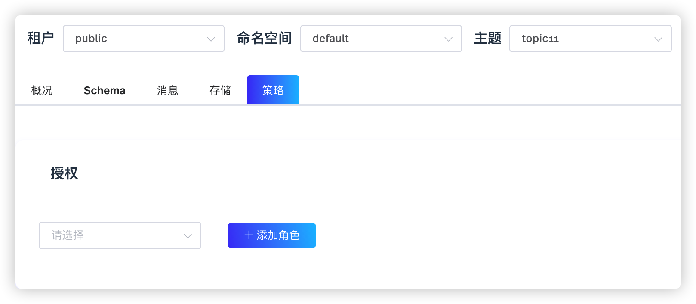

Pulsar 支持认证机制，验证客户端的身份信息，并将客户端与角色令牌相关联。Pulsar 也支持授权机制，授权 Pulsar 客户端访问租户、命名空间、主题等。

超级用户拥有最高权限。超级用户可以创建、删除租户，访问租户中的所有资源。创建租户时，超级用户可以为该租户分配管理员角色。租户的管理员可以为租户创建、修改、删除命名空间。当命名空间配置其他角色时，超级用户可以授予和撤销其他角色的权限。

本文介绍如何使用 StreamNative Cloud Manager 为 Pulsar 组件授权。用户也可以通过 pulsar-admin 或 pulsar-perf 等 CLI 工具为 Pulsar 组件授权。有关详细信息，参见 [pulsar-admin](https://pulsar.apache.org/docs/en/pulsar-admin) 和 [pulsar-perf](https://pulsar.apache.org/docs/en/reference-cli-tools/#pulsar-perf)。

# 授权租户

在创建租户时，StreamNative Cloud Manager 支持为租户指定管理员并对其授权。

如需授权租户，遵循以下步骤。

1. 在左侧导航栏，单击**租户**。

2. 单击**创建租户**按钮，进入**创建租户**页面，如下所示。

   

3. 在 **Admin 角色**下拉列表，选择一个或多个用户，作为租户的管理员。

4. 单击**确定**按钮，为租户配置一个或多个管理员。

StreamNative Cloud Manager 也支持添加或删除租户管理员。

1. 在左侧导航栏，单击**租户**。

2. 在**操作**列，单击**编辑**按钮（铅笔图标）或者单击租户名称，进入编辑租户的页面。然后选择**配置**页签。

   

3. 在**权限**区域，单击**添加角色**按钮，为租户添加一个或多个管理员。单击指定管理员左侧的**删除**图标，删除该租户管理员。

# 授权命名空间

如需授权命名空间，遵循以下步骤。

1. 在左侧导航栏，单击**命名空间**。

2. 在**操作**列，单击**编辑**按钮（铅笔图标）或者单击命名空间名称，进入编辑命名空间的页面。然后选择**策略**页签。

   

3. 在**授权**区域，选择命名空间的管理员，然后为其配置相关权限。

   - consume：授予或撤销其他客户端的消费权限。
   - produce：授予或撤销其他客户端的生产权限。
   - functions：授予或撤销其他客户端的 Pulsar Functions 权限。

# 授权主题

如需授权主题，遵循以下步骤。

1. 在左侧导航栏，单击**主题**。

2. 单击主题名称链接。或者单击分区主题的分区链接。

3. 选择**策略**页签，配置主题的授权策略。

   

4. 在**授权**区域，选择主题的管理员，然后为其配置相关权限。

   - consume：授予或撤销其他客户端的消费权限。
   - produce：授予或撤销其他客户端的生产权限。
   - functions：授予或撤销其他客户端的 Pulsar Functions 权限。