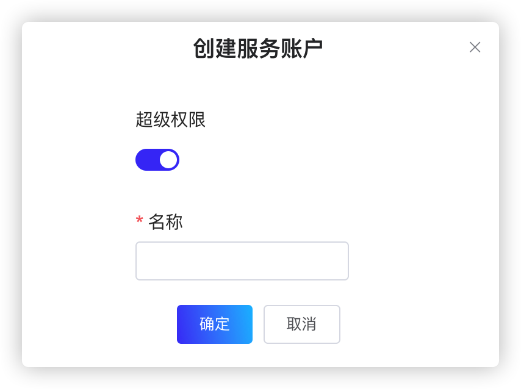

用户可以创建服务帐户，自动执行某些操作，例如对在组织内运行的机器人进行验证。

# 配置服务账户（snctl）

本节介绍如何通过 snctl 创建、管理服务账户。

> **说明**  
> 本文档使用 `matrix` 作为组织的名称。

## 创建服务账户（snctl）

如需创建服务账户，遵循以下步骤。

1. 创建 `sa-bot.yaml` 文件，并在 `.yaml` 文件中定义服务账户 `bot` 的配置，如下所示。

    ```yaml
    apiVersion: cloud.streamnative.io/v1alpha1
    kind: ServiceAccount
    metadata:
      namespace: matrix
      name: bot
    ```

    下表列出 `.yaml` 文件中的各项参数。

    | 参数 | 描述 |
    | --- | --- |
    | apiVersion| 指定 Pulsar API 服务器的版本。|
    | kind | 指定要创建的 StreamNative Cloud 组件。|
    | metadata | 配置服务账户的元数据信息。<br>-namespace：指定服务账户所在的组织。 <br>-name：指定服务账户的名称。|

2. 下发 `.yaml` 文件，创建服务账户 `bot`。

    ```bash
    snctl apply -f /path/to/sa-bot.yaml
    ```

    **命令回显**

    ```
    serviceaccount.cloud.streamnative.io/bot created
    ```

3. 查看是否成功创建服务账户。

    ```bash
    snctl describe serviceaccount bot
    ```

    **命令回显**

    ```
    Name:         bot
    Namespace:    matrix
    Labels:       <none>
    Annotations:  <none>
    API Version:  cloud.streamnative.io/v1alpha1
    Kind:         ServiceAccount
    Metadata:
      Creation Timestamp:  2020-08-11T16:25:10Z
      Finalizers:
        serviceaccount.finalizers.cloud.streamnative.io
      Generation:        1
      Resource Version:  396516
      Self Link:         /apis/cloud.streamnative.io/v1alpha1/namespaces/matrix/serviceaccounts/bot
      UID:               874b226b-ea01-41c2-9a7b-059fdcc0d5c1
    Spec:
    Status:
      Conditions:
        Last Transition Time:  2020-08-14T06:25:52Z
        Reason:                Provisioned
        Status:                True
        Type:                  Ready
      Private Key Data:        
      Private Key Type:        TYPE_SN_CREDENTIALS_FILE
    Events:                    <none>
    ```

    当 `status` 和 `type` 参数的取值为 `true` 和 `ready` 时，则表示已成功创建服务账户。

用户也可以使用 `snctl create serviceaccount SERVICE_ACCOUNT_NAME` 命令创建服务账户。有关详细信息，参见 [snctl CLI 参考](https://docs.streamnative.io/snctl/v0.7.0/)。

## 下载服务账户的密钥

如需使用服务账户，需要下载服务账户的密钥并将其保存为 JSON 格式的密钥文件。运行 `snctl describe serviceaccount SERVICE_ACCOUNT_NAME` 命令，即可在命令回显中的 `status` 字段查看服务账户的密钥。

运行以下命令，将服务账户 `bot` 的密钥保存为 `bot.json` 密钥文件。

```bash
snctl auth export-service-account bot --file bot.json
```

以下是密钥文件的示例。

```json
{
  "type": "sn_service_account",
  "client_id": "client_id",
  "client_secret": "client_secret",
  "client_email": "bot@matrix.auth.streamnative.cloud.cn"
}
```

下表列出 `.json` 文件中的各项参数。

| 参数 | 描述 |
| --- | --- |
| `client_id` | 已创建的 Auth0 应用程序的 ID。 |
| `client_secret` | 访问 snctl 时，用于验证的的 token。 |

> **说明**  
> 密钥文件包含服务帐户的 token。用户需要妥善保存该密钥文件。

## 激活服务账户

运行以下命令，使用 `bot.json` 密钥文件激活服务账户。

```bash
snctl auth activate-service-account --key-file bot.json -a https://api.streamnative.cloud -i https://auth.streamnative.cloud.cn/
```

**命令回显**

```plain
Logged in as bot@matrix.auth.streamnative.cloud.cn.
Welcome to StreamNative Cloud!
```

## 访问 StreamNative Cloud API

如需使用服务账户访问 StreamNative Cloud API，遵循以下步骤。

1. 登录 snctl。

    ```
    snctl auth login
    ```

2. 创建服务账户。

    ```
    snctl snctl create serviceaccount bot.
    ```

    **命令回显**
    ```
    serviceaccount.cloud.streamnative.io/bot created
    ```

3. 下载服务账户的密钥，并将其保存为 JSON 格式的文件。

    ```
    snctl auth export-service-account bot -f bot.json
    ```
    **命令回显**
    ```
    Wrote private key file 'bot.json'.
    ```

4. 为服务账户配置 “Admin” 角色。

    ```
    snctl create rolebinding bot-cluster-admin --role admin --serviceaccount bot
    ```

    **命令回显**
    ```
    rolebinding.cloud.streamnative.io/bot-cluster-admin created
    ```

5. 退出 snctl。

    ```
    snctl auth logout
    ```

6. 使用服务账户登录 snctl。

    ```
    snctl auth activate-service-account --key-file bot.json
    ```

    **命令回显**
    ```
    Logged in as bot@matrix.auth.streamnative.cloud.cn.
    Welcome to StreamNative Cloud!
    ```

## 连接 Pulsar 集群

如需使用服务账户连接 Pulsar 集群，遵循以下步骤。

1. 登录 snctl。

    ```
    snctl auth login
    ```

2. 创建服务账户。

    ```
    snctl snctl create serviceaccount bot.
    ```

    **命令回显**
    ```
    serviceaccount.cloud.streamnative.io/bot created
    ```

3. 下载服务账户的密钥，并将其保存为 JSON 格式的文件。

    ```
    snctl auth export-service-account bot -f bot.json
    ```
    **命令回显**
    ```
    Wrote private key file 'bot.json'.
    ```

4. 使用 pulsarctl 连接 Pulsar 集群。将 `YOUR-KEY-FILE-PATH` 参数替换为 `.json` 文件的保存路径。有关如何使用其他 Pulsar CLI 工具连接 Pulsar 集群的详细信息，参见[连接集群](/connect/overview.md)。

    ```
    pulsarctl namespaces list public \
        --admin-service-url https://neo1.matrix.cn-zjk.streamnative.ali.snpulsar.cn \
        --issuer-endpoint https://api.cloud.streamnative.cn \
        --client-id abcdefghigk0123456789 \
        --audience urn:sn:pulsar:pulsar-instance-ns:pulsar-instance-name \
        --key-file YOUR-KEY-FILE-PATH
    ```

## 查看服务账户（snctl）

运行以下命令，查看所有已创建的服务账户。

```bash
snctl get serviceaccount
```

**命令回显**

```
NAME   CREATED AT
bot   2020-08-11T16:25:10Z
```

## 查看服务账户详情（snctl）

如需查看指定服务账户的详细信息，遵循以下步骤。

1. 确认目标服务账户是否存在。

    ```bash
    snctl get serviceaccount
    ```

2. 运行以下命令，查看指定服务账户的详细信息。

    ```bash
    snctl describe serviceaccount SERVICE_ACCOUNT_NAME
    ```

以下示例说明如何查看 `bot` 服务账户的详细信息。

```bash
snctl describe serviceaccount bot
```

**命令回显**
```
Name:         bot
Namespace:    matrix
Labels:       <none>
Annotations:  <none>
API Version:  cloud.streamnative.io/v1alpha1
Kind:         ServiceAccount
Metadata:
  Creation Timestamp:  2020-08-11T16:25:10Z
  Finalizers:
    serviceaccount.finalizers.cloud.streamnative.io
  Generation:        1
  Resource Version:  396516
  Self Link:         /apis/cloud.streamnative.io/v1alpha1/namespaces/matrix/serviceaccounts/bot
  UID:               874b226b-ea01-41c2-9a7b-059fdcc0d5c1
Spec:
Status:
  Conditions:
    Last Transition Time:  2020-08-14T06:25:52Z
    Reason:                Provisioned
    Status:                True
    Type:                  Ready
  Private Key Data:        
  Private Key Type:        TYPE_SN_CREDENTIALS_FILE
Events:                    <none>
```

## 删除服务账户（snctl）

运行以下命令，根据服务账户名称，删除指定服务账户。

```bash
snctl delete serviceaccount SERVICE_ACCOUNT_NAME
```

StreamNative Cloud 也支持在 `.yaml` 文件中定义服务账户名称，然后下发该 `.yaml` 文件，删除指定服务账户。

```
snctl delete -f ./sa-bot.yaml
```

# 配置服务账户（StreamNative Cloud Manager）

本节介绍如何通过 StreamNative Cloud Manager 创建、管理服务账户。

## 创建服务账户（StreamNative Cloud Manager）

如需创建服务账户，遵循以下步骤。

1. 在左侧导航栏，单击**管理 > 服务账户**。

2. 单击**创建服务账户**按钮，进入创建服务账户的页面，如下所示。

   

3. 在弹出的页面，输入服务账户的名称，然后单击**确定**按钮。服务账户名称采用字符串形式，最多支持 12 个字符。支持小写字母（a～z）、数字（0～9）、特殊字符（“-”）。

## 查看服务账户（StreamNative Cloud Manager）

在左侧导航栏，单击**管理 > 服务账户**，查看服务账户的详细信息。

| 参数 | 描述 |
| --- | --- |
| 名称 | 服务账户的名称。 |
| 邮箱地址 | 服务账户的邮箱地址。 |
| 密钥文件 | 服务账户的密钥文件。|
| Token | 服务账户的 token。|
| 组织 | 服务账户所属的组织。 |
| 创建时间 | 服务账户的创建时间。|
| 状态 | 服务账户的状态。|
| Admin| 服务账户的 Admin 角色。|
| 操作 | 服务账户支持的操作。|

## 下载服务账户的密钥文件或 token

StreamNative Cloud 支持使用密钥文件或 token 验证服务账户。但是，token 具有一定的有效期。当 token 失效后，用户需要使用密钥文件生成一个新的 token，才能验证服务账户。

如需下载服务账户的密钥文件 或 token，遵循以下步骤。

1. 在左侧导航栏，单击**管理 > 服务账户**。

2. 单击密钥文件的**下载**链接，下载服务账户的密钥文件到本地。

3. 单击 token 的**下载**链接，或者单击**复制**图标，下载或复制服务账户的 Token 到本地。

## 删除服务账户（StreamNative Cloud Manager）

如需删除服务账户，遵循以下步骤。

1. 在左侧导航栏，单击**管理 > 服务账户**。

2. 在**操作**列，单击**删除**按钮（垃圾桶图标），弹出提示框。

3. 在**删除**对话框，单击**确定**按钮，删除服务账户。
