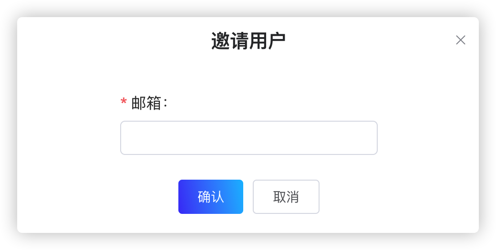

组织的管理员可以邀请用户加入组织，查看当前用户信息或删除当前用户。

# 配置用户（snctl）

本节介绍如何通过 snctl 创建、管理用户。

## 前提条件

创建组织。有关创建组织的详细信息，参见[创建组织](/use/organization.md#创建组织)。

> **说明**  
> 本文档使用 `matrix` 作为组织的名称。

## 创建用户（snctl）

如需创建用户，遵循以下步骤。

1. 创建 `user-ironman.yaml` 文件，并在 `.yaml` 文件中定义用户 `ironman` 的配置，如下所示。

    ```yaml
    apiVersion: cloud.streamnative.io/v1alpha1
    kind: User
    metadata:
      namespace: matrix
      name: ironman
    spec:
      type: internal
      email: ironman@matrix.local
      name:
        first: Tony
        last: Stark
    ```

    下表列出 `.yaml` 文件中的各项参数。

    | 参数 | 描述 |
    | --- | --- |
    | apiVersion| 指定 Pulsar API 服务器的版本。|
    | kind | 指定要创建的 StreamNative Cloud 组件。|
    | metadata | 配置用户的元数据信息。<br>-namespace：指定用户所在的组织。 <br>-name：指定用户名称。|
    | spec | 配置用户的相关参数。<br>- type：指定用户类型。 <br>- email：指定用户的邮箱地址。 <br>- name：指定用户的名字和姓氏。 |

2. 下发 `.yaml` 文件，创建用户 `ironman`。

    ```bash
    snctl apply -f /path/to/user-ironman.yaml
    ```

3. 查看是否成功创建用户。

    ```bash
    snctl describe users ironman
    ```

    **命令回显**
    ```
    Name:         ironmanmatrix.local
    Namespace:    matrix
    Labels:       <none>
    Annotations:  <none>
    API Version:  cloud.streamnative.io/v1alpha1
    Kind:         User
    Metadata:
      Creation Timestamp:  2020-08-10T14:31:12Z
      Finalizers:
        user.finalizers.cloud.streamnative.io
      Generation:        1
      Resource Version:  104126
      Self Link:         /apis/cloud.streamnative.io/v1alpha1/namespaces/matrix/users/ironman@matrix.local
      UID:               5f6297c6-8e64-4175-b866-bb6362437f29
    Spec:
      Email:  ironman@matrix.local
      Name:
        First:  Tony
        Last:   Stark
      Type:     internal
    Status:
    Events:  <none>
    ```

## 查看用户（snctl）

运行以下命令，查看所有已创建的用户。

```bash
snctl get users
```

**命令回显**

```
NAME                     CREATED AT
ironman@matrix.local   2020-08-10T14:31:12Z
```

## 查看用户详情（snctl）

如需查看指定用户的详细信息，遵循以下步骤。

1. 确认目标用户是否存在。

```bash
snctl get users
```

2. 运行以下命令，查看指定用户的详细信息。

```
snctl describe users USER_NAME
```

以下示例说明如何查看用户 `ironman` 的详细信息。

```bash
snctl describe users ironman
```

**命令回显**
```
Name:         ironman@matrix.local
Namespace:    matrix
Labels:       <none>
Annotations:  <none>
API Version:  cloud.streamnative.io/v1alpha1
Kind:         User
Metadata:
  Creation Timestamp:  2020-08-10T14:31:12Z
  Finalizers:
    user.finalizers.cloud.streamnative.io
  Generation:        1
  Resource Version:  104126
  Self Link:         /apis/cloud.streamnative.io/v1alpha1/namespaces/matrix/users/ironman@matrix.local
  UID:               5f6297c6-8e64-4175-b866-bb6362437f29
Spec:
  Email:  ironman@matrix.local
  Name:
    First:  Tony
    Last:   Stark
  Type:     internal
Status:
Events:  <none>
```

## 删除用户（snctl）

运行以下命令，根据用户名称，删除指定用户。

```bash
snctl delete users USER_NAME
```

StreamNative Cloud 也支持在 `.yaml` 文件中定义用户类型和用户名称，然后下发该 `.yaml` 文件，删除指定用户。

```
snctl delete -f ./user-ironman.yaml
```

# 配置用户（StreamNative Cloud Manager）

本节介绍如何通过 StreamNative Cloud Manager 创建、管理用户。

## 邀请用户

如需邀请用户，遵循以下步骤。

1. 在 StreamNative Cloud Manager 主界面，单击右上角用户账户右侧的下拉菜单，然后选择**用户**。

2. 单击**邀请用户**按钮，弹出对话框，如下所示。

    

3. 输入用户的邮箱地址，然后单击**确定**按钮，发送邀请链接到受邀用户的邮箱。也可以单击受邀用户**状态**列旁侧的复制按钮，复制邀请链接，直接发送给受邀用户。如果在一定时间内，受邀用户未接受邀请，可以单击**重新发送邀请**按钮，重新发送邀请链接。

4. 将电子邮件中的邀请链接复制粘贴到浏览器的地址栏。

5. 如果受邀用户尚未注册 StreamNative Cloud 服务账户，用户需要先注册 StreamNative Cloud 服务账户，然后使用注册时设置的邮箱和密码登录 StreamNative Cloud Manager。有关注册 StreamNative Cloud 服务账户的详细信息，参见[注册](/overview.md#注册)。如果受邀用户已经注册 StreamNative Cloud 服务账户，则直接使用邮箱和密码登录 StreamNative Cloud Manager。有关登录 StreamNative Cloud Manager 的详细信息，参见[登录 StreamNative Cloud Manager](/overview.md/#登录-streamnative-cloud-manager)。

6. 单击**接受**按钮，加入组织。

## 查看用户（StreamNative Cloud Manager）

在 StreamNative Cloud Manager 主界面，单击右上角用户账户右侧的下拉菜单，然后选择**用户**，查看已创建的用户，包括用户的邮箱地址、状态、以及用户支持的操作。

## 删除用户（StreamNative Cloud Manager）

> **说明**  
> 只有组织的管理员，才可以删除用户。

如需删除用户，遵循以下步骤。

1. 在 StreamNative Cloud Manager 主界面，单击右上角用户账户右侧的下拉菜单，然后选择**用户**。

2. 在**操作**列，单击**删除**按钮（垃圾桶图标），弹出提示框。

3. 在**删除**对话框，单击**确定**按钮，删除用户。