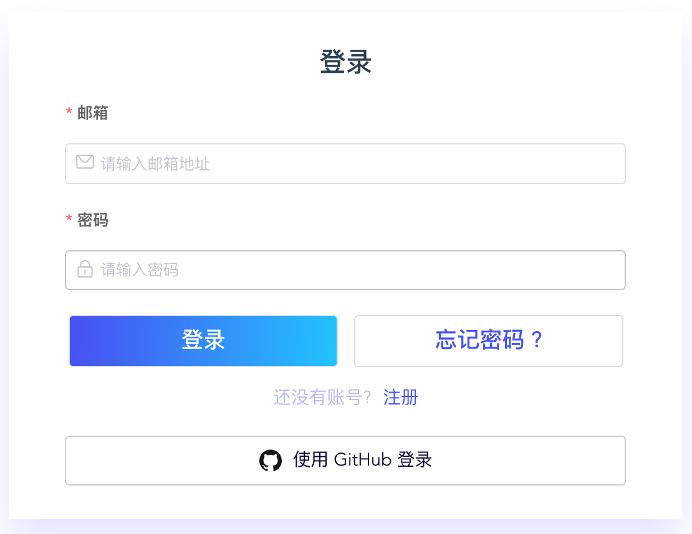

# 准备工作

- 安装 snctl。有关安装 snctl 的详细信息，参见[安装 snctl](/overview.md#安装-snctl)。
- 登录 [StreamNative Cloud Manager](https://console.cloud.streamnative.cn/?defaultMethod=login) 并获得授权。
- 创建组织。本文使用 `matrix` 作为组织的名称。

# 步骤一：登录 snctl

> **说明**  
> - StreamNative Cloud 使用第三方 cookie 加载登录页面。Google Chrome 浏览器会阻止设置的第三方 cookie。当 Google Chrome 浏览器阻止第三方 cookie 时，用户的地址栏右侧会弹出 cookie 图标。单击该图标来检查网站允许和阻止的第三方 cookie，然后选择阻止或允许单个 cookie。
> - 默认情况下，Google Chrome 会阻止弹出式窗口自动显示在屏幕上。如果 Google Chrome 拦截了某个弹出式窗口，则会在地址栏中显示**已拦截弹出窗口**。

1. 使用 `cd` 命令切换到压缩文件 `.tar.gz.` 解压后的目录，然后打开一个终端窗口。

2. 使用缺省配置，初始化 snctl 配置。

    ```bash
    snctl config init --site cn
    ```

3. 运行以下命令，弹出一个对话框，如下所示。

    ```bash
    snctl auth login
    ```

    

4. 单击地址栏右侧的 **cookie** 图标。

5. 单击**网站无法正常工作？**链接，查看网站允许或阻止的 cookies。然后单击**允许所有 cookies** 按钮。

6. 输入电子邮箱地址和密码，然后单击**登录**。或者单击**使用 GitHub 登录**按钮，在弹出的页面中，单击**Authorize streamnative** 按钮，使用 GitHub 账户登录 snctl。

7. 单击地址栏右侧的**已拦截弹出窗口**图标。

8. 勾选“始终允许弹出窗口和重定向”，然后单击**完成**按钮。

# 步骤二：创建实例

以下举例说明如何创建支持标准集群的 Pulsar 实例。如需创建支持免费集群的 Pulsar 实例，需要将 `type` 字段设置为 `free`。如果用户未在 `.yaml` 文件中指定 `type` 字段，则默认支持标准集群的 Pulsar 实例。有关创建实例的详细信息，参见[创建实例（snctl）](/use/instance.md#创建实例-snctl)。

1. 创建清单文件 `instance-neo.yaml`，并在清单文件中定义实例 `neo` 的配置，如下所示。

    ```yaml
    apiVersion: cloud.streamnative.io/v1alpha1
    kind: PulsarInstance
    metadata:
      namespace: matrix
      name: neo
    spec:
      availabilityMode: zonal
    ```

2. 下发清单文件，创建实例 `neo`。

    ```bash
    snctl apply -f /path/to/instance-neo.yaml
    ```

# 步骤三：创建集群

StreamNative Cloud 支持创建免费集群和标准集群。以下举例说明如果创建标准集群。有关创建免费集群的详细信息，参见[创建集群（StreamNative Cloud Manager）](/use/cluster.md#创建集群streamnative-cloud-manager)。

> **说明**  
> 在本版本中，每个实例只能配置一个集群。

1. 创建清单文件 `clusterneo1.yaml`，并在清单文件中定义集群 `neo-1` 的配置，如下所示。

    ```
    apiVersion: cloud.streamnative.io/v1alpha1
    kind: PulsarCluster
    metadata:
      namespace: matrix
      name: neo-1
    spec:
      instanceName: neo
      location: cn-zjk
      broker:
        replicas: 1
        resourceSpec:
          nodeType: tiny-1
      bookkeeper:
        replicas: 3
        resourceSpec:
          nodeType: tiny-1
    ```

2. 下发清单文件，创建集群 `neo-1`。
    
    ```bash
    snctl apply -f /path/to/clusterneo1.yaml
    ```

# 步骤四：创建服务账户

1. 创建清单文件 `sa-bot.yaml`，并在清单文件中定义服务账户 `bot` 的配置，如下所示。

    ```yaml
    apiVersion: cloud.streamnative.io/v1alpha1
    kind: ServiceAccount
    metadata:
      namespace: matrix
      name: bot
    ```

2. 下发清单文件，创建服务账户 `bot`。

    ```bash
    snctl apply -f /path/to/sa-bot.yaml
    ```

# 步骤五：为服务账户配置角色

1. 创建清单文件 `rolebinding.yaml`，并在清单文件中为服务账户 `bot` 配置 Admin 角色，如下所示。

    ```yaml
    apiVersion: cloud.streamnative.io/v1alpha1
    kind: RoleBinding
    metadata:
      name: test
      namespace: matrix
    spec:
      subjects:
        kind: ServiceAccount
        name: bot
        apiGroup: cloud.streamnative.io
      roleRef:
        kind: Role # must be Role
        name: admin # must match the name of the Role need to bind to
        apiGroup: cloud.streamnative.io
    ```

2. 下发清单文件，为服务账户 `bot` 配置 Admin 角色。

    ```bash
    snctl apply -f /path/to/rolebinding.yaml
    ```

# 步骤六：连接集群

以下举例说明 Pulsar Java 客户端如何使用 OAuth2 认证插件连接集群。有关其他 Pulsar CLI 工具或 Pulsar 客户端连接集群的详细信息，参见[连接集群](/connect/overview.md)。

1. 获取 Service URL。有关如何获取 Service URL 的详细信息，参见[获取 Pulsar Service URL](/connect/overview.md#获取-service-url)。

2. 获取 OAuth2 认证参数。有关如何获取 OAuth2 认证参数的详细信息，参见[获取 OAuth2 认证参数](/connect/overview.md#获取-oauth2-authentication-parameters)。

3. 使用 OAuth2 认证插件，连接集群。根据获取的 Service URL 和 OAuth2 认证参数，配置 `serviceUrl`、`issuer_url`、 `audience`、 `credentialsUrl` 参数。

    ```java
    PulsarClient client = PulsarClient.builder()
    .serviceUrl("pulsar+ssl://streamnative.cloud:6651")
    .authentication(
        AuthenticationFactoryOAuth2.clientCredentials(this.issuerUrl, this.credentialsUrl, this.audience))
    .build();
    ```

4. 创建 Pulsar consumer，消费消息。

    ```Java
    Consumer<byte[]> consumer = client.newConsumer(Schema.BYTES)
            .topic(topic)
            .subscriptionName("sub-1")
            .subscriptionInitialPosition(SubscriptionInitialPosition.Earliest)
            .subscribe();

    for (int i = 0; i < 10; i++) {
        Message<byte[]> msg = consumer.receive();
        consumer.acknowledge(msg);
        System.out.println("Receive message " + new String(msg.getData()));
    }
    ```

5. 创建 Pulsar producer，发布消息。

    ```Java
        PulsarClient client = PulsarClient.builder()
                .serviceUrl(jct.serviceUrl)
                .authentication(
                        AuthenticationFactoryOAuth2.clientCredentials(new URL(jct.issuerUrl), new URL(jct.credentialsUrl), jct.audience))
                .build();

        ProducerBuilder<byte[]> producerBuilder = client.newProducer().topic(topic)
                .producerName("my-producer-name");
        Producer<byte[]> producer = producerBuilder.create();

        for (int i = 0; i < 10; i++) {
            String message = "my-message-" + i;
            MessageId msgID = producer.send(message.getBytes());
            System.out.println("Publish " + "my-message-" + i + " and message ID " + msgID);
        }
    ```

# 步骤七：退出 snctl

运行以下命令，退出 snctl。

```bash
snctl auth logout
```
