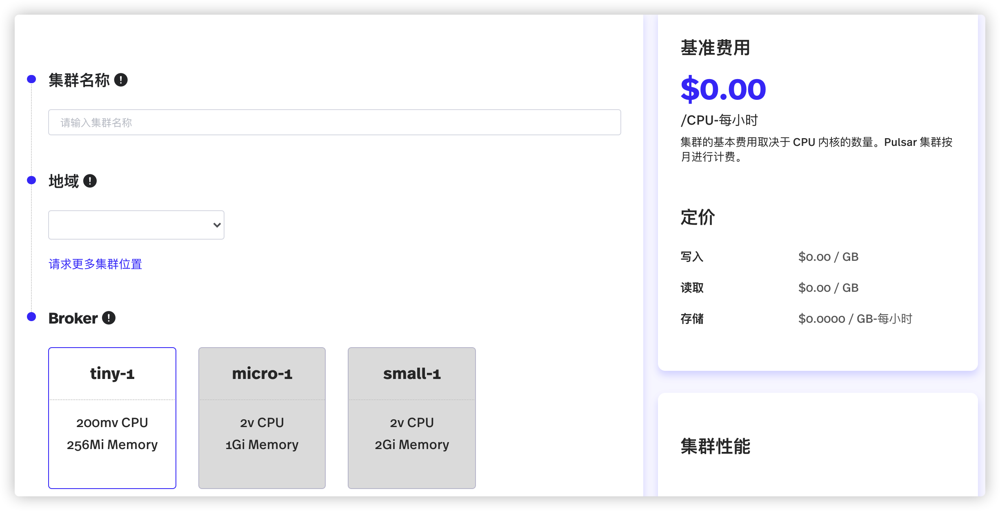
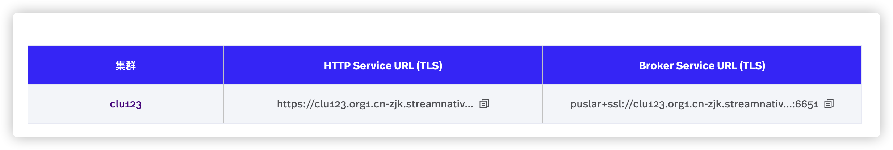
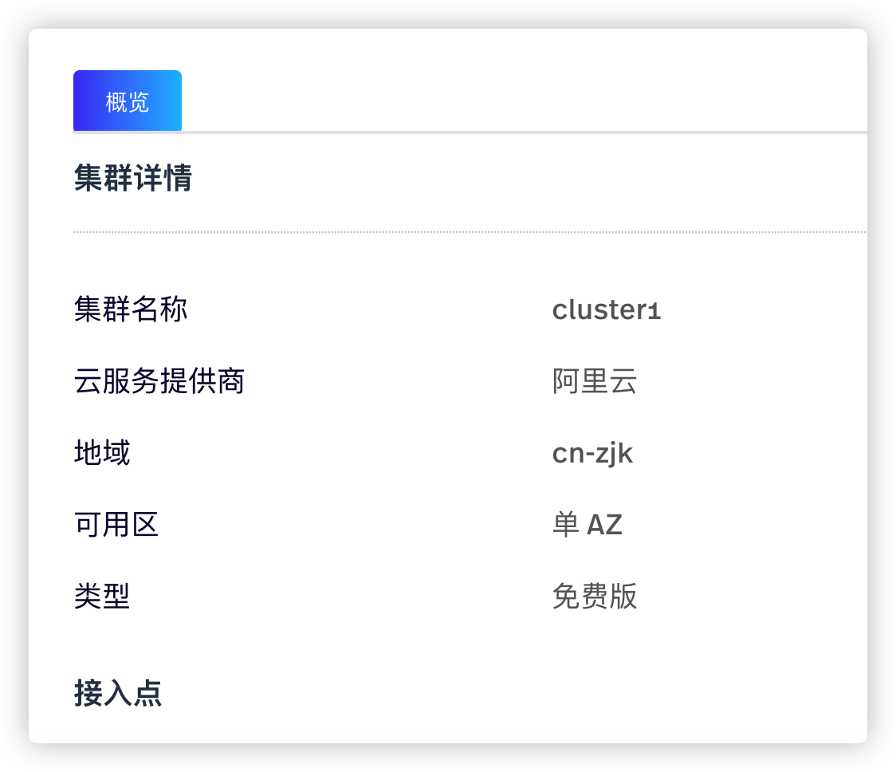

集群由 Pulsar broker 和 bookie 组成。创建实例后，用户即可为该实例创建集群。目前，每个实例只能配置一个集群。

# 配置集群（snctl）

本节介绍如何通过 snctl 创建、管理集群。

## 前提条件

创建组织和实例。有关创建组织和实例的详细信息，参见[创建组织](/use/organization.md#创建组织)和[创建实例](/use/instance.md#创建实例snctl)。本节使用 `matrix` 作为组织的名称。

## 创建集群（snctl）

如需创建集群，遵循以下步骤。

1. 创建 `clusterneo1.yaml` 文件，并在 `.yaml` 文件中定义集群 `neo-1` 的配置，如下所示。

    ```yaml
    apiVersion: cloud.streamnative.io/v1alpha1
    kind: PulsarCluster
    metadata:
      namespace: matrix
      name: neo-1
    spec:
      instanceName: neo
      location: cn-zjk
      broker:
        replicas: 1
        resourceSpec:
          nodeType: tiny-1
      bookkeeper:
        replicas: 3
        resourceSpec:
          nodeType: tiny-1
    ```

    下表列出 `.yaml` 文件中的各项参数。

    | 参数 | 描述 |
    | --- | --- |
    | apiVersion| 指定 Pulsar API 服务器的版本。|
    | kind | 指定要创建的 StreamNative Cloud 组件。|
    | metadata | 配置集群的元数据信息。<br>-namespace：指定集群所在的组织。 <br>-name：指定集群名称。|
    | spec | 配置集群的相关参数。 <br>-instanceName：指定集群所属实例的名称。<br>-location：配置集群所在的地理位置。 <br>-broker：配置 broker，包括 broker 的数量和资源类型([节点类型](/concepts/concepts.md#集群配置))。 <br>-bookkeeper：配置 BookKeeper，包括 BookKeeper 的数量和资源类型([节点类型](/concepts/concepts.md#集群配置))。免费集群不支持 BookKeeper 参数。|

2. 下发 `.yaml` 文件，创建集群 `neo-1`。

    ```bash
    snctl apply -f /path/to/clusterneo1.yaml
    ```

3. 查看是否成功创建集群。

    ```bash
    snctl describe pulsarcluster neo-1
    ```

    **命令回显**
    ```
    Name:         neo-1
    Namespace:    matrix
    Labels:       <none>
    Annotations:  <none>
    API Version:  cloud.streamnative.io/v1alpha1
    Kind:         PulsarCluster
    Metadata:
      Creation Timestamp:  2020-08-11T15:57:46Z
      Finalizers:
        pulsarcluster.finalizers.cloud.streamnative.io
      Generation:        1
      Resource Version:  245514
      Self Link:         /apis/cloud.streamnative.io/v1alpha1/namespaces/matrix/pulsarclusters/neo-1
      UID:               0465dacb-e534-46c8-954c-03efb925aa16
    Spec:
      Bookkeeper:
        Replicas:  3
      Broker:
        Replicas:  1
      Instance Name:  neo
      Location:       cn-zjk
      Service Endpoints:
        Dns Name:  ali.snpulsar.cn
    Status:
      Conditions:
        Last Transition Time:  2020-08-12T11:42:53Z
        Reason:                Deploy
        Status:                True
        Type:                  ZookeeperReady
        Last Transition Time:  2020-08-11T16:05:49Z
        Message:               All components are ready
        Reason:                Deploy
        Status:                True
        Type:                  BookKeeperReady
        Last Transition Time:  2020-08-11T16:02:18Z
        Reason:                Deploy
        Status:                True
        Type:                  PulsarBrokerReady
        Last Transition Time:  2020-08-11T16:04:07Z
        Reason:                Deploy
        Status:                True
        Type:                  PulsarProxyReady
        Last Transition Time:  2020-08-12T11:42:53Z
        Reason:                AllConditionStatusTrue
        Status:                True
        Type:                  Ready
    Events:                    <none>
    ```

    当 `status` 和 `type` 参数的取值为 `true` 和 `ready` 时，则表示已成功创建集群。

用户也可以使用 `snctl create pulsarcluster PULSAR_CLUSTER_NAME` 命令创建标准集群。有关详细信息，参见 [snctl CLI 参考](https://docs.streamnative.io/snctl/v0.7.0/)。

## 查看集群（snctl）

运行以下命令，查看所有已创建的集群。

```bash
snctl get pulsarcluster
```

**命令回显**

```shell
NAME            CREATED AT
cluster-test   2020-08-14T01:48:46Z
neo-1           2020-08-11T15:57:46Z
test11         2020-08-12T13:24:19Z
```

## 查看集群详情（snctl）

如需查看指定集群的详细信息，遵循以下步骤。

1. 确认目标集群是否存在。

    ```bash
    snctl get pulsarcluster
    ```

2. 运行以下命令，查看指定集群的详细信息。

    ```bash
    snctl describe pulsarcluster PULSAR_CLUSTER_NAME
    ```

以下示例说明如何查看 `neo-1` 集群的详细信息。

```bash
snctl describe pulsarcluster neo-1
```

**命令回显**

```
Name:         neo-1
Namespace:    matrix
Labels:       <none>
Annotations:  <none>
API Version:  cloud.streamnative.io/v1alpha1
Kind:         PulsarCluster
Metadata:
  Creation Timestamp:  2020-08-11T15:57:46Z
  Finalizers:
    pulsarcluster.finalizers.cloud.streamnative.io
  Generation:        1
  Resource Version:  245514
  Self Link:         /apis/cloud.streamnative.io/v1alpha1/namespaces/matrix/pulsarclusters/neo-1
  UID:               0465dacb-e534-46c8-954c-03efb925aa16
Spec:
  Bookkeeper:
    Replicas:  3
  Broker:
    Replicas:  1
  Instance Name:  neo
  Location:       cn-zjk
  Service Endpoints:
    Dns Name:  ali.snpulsar.cn
Status:
  Conditions:
    Last Transition Time:  2020-08-12T11:42:53Z
    Reason:                Deploy
    Status:                True
    Type:                  ZookeeperReady
    Last Transition Time:  2020-08-11T16:05:49Z
    Message:               All components are ready
    Reason:                Deploy
    Status:                True
    Type:                  BookKeeperReady
    Last Transition Time:  2020-08-11T16:02:18Z
    Reason:                Deploy
    Status:                True
    Type:                  PulsarBrokerReady
    Last Transition Time:  2020-08-11T16:04:07Z
    Reason:                Deploy
    Status:                True
    Type:                  PulsarProxyReady
    Last Transition Time:  2020-08-12T11:42:53Z
    Reason:                AllConditionStatusTrue
    Status:                True
    Type:                  Ready
Events:                    <none>
```

## 删除集群（snctl）

运行以下命令，根据集群名称，删除指定集群。

```bash
snctl delete pulsarcluster PULSAR_CLUSTER_NAME
```

StreamNative Cloud 也支持在 `.yaml` 文件中定义集群名称，然后下发该 `.yaml` 文件，删除指定集群。

```
snctl delete -f ./clusterneo1.yaml
```

# 配置集群（StreamNative Cloud Manager）

本节介绍如何通过 StreamNative Cloud Manager 创建、管理集群。

## 前提条件

创建组织和实例。有关创建组织和实例的详细信息，参见[创建组织](/use/organization.md#创建组织)和[创建实例](/use/instance.md#创建实例streamnative-cloud-manager)。本节使用 `matrix` 作为组织的名称。

## 创建集群（StreamNative Cloud Manager）

如需创建集群，遵循以下步骤。

1. 在**组织**页面，单击目标实例。

2. 在弹出的**实例**界面，单击**创建集群**按钮。

   

3. 在弹出的页面上，配置集群参数，如下所示。在页面右侧，显示集群的基本费用信息。

    | 参数 | 描述 |
    | --- | --- |
    | 集群名称 | 输入集群名称，字符串形式，支持小写字母（a～z）、数字（0～9）、特殊字符（“-”）。 |
    | 地域 | 选择集群位置。<br>-cn-zjk：张家口，河北省，中国|
    | Broker| 配置集群的 broker 参数，包括需要配置的 broker 和 pod 的数量。对于免费版集群，只支持配置为 `Tiny` 类型。 |
    | Bookie 节点 | 配置 Bookie 节点的数量。对于免费版集群，该参数不可用。|

4. 单击**创建集群**按钮。在弹出的页面，查看集群的创建进度。

## 查看集群（StreamNative Cloud Manager）

在左侧导航栏，单击**管理 > 集群**，查看指定实例的集群信息，包括集群名称和 Service URL。目前，每个实例只能配置一个集群。



## 查看集群详情（StreamNative Cloud Manager）

如需查看指定集群的详细信息，遵循以下步骤。

1. 在左侧导航栏，单击**管理 > 集群**。

2. 单击目标集群，查看集群的详细信息，包括集群的名称、集群位置、集群部署方式、云服务提供商、集群类型、Service URL。

    

## 删除集群（StreamNative Cloud Manager）

如需删除集群，遵循以下步骤。

1. 在左侧导航栏，单击**管理 > 集群**。

2. 在弹出的页面，单击**删除集群**按钮，弹出提示框。

3. 在**删除**对话框，单击**确定**按钮，删除集群。

# 下一步

- [配置租户](/use/tenant.md)
