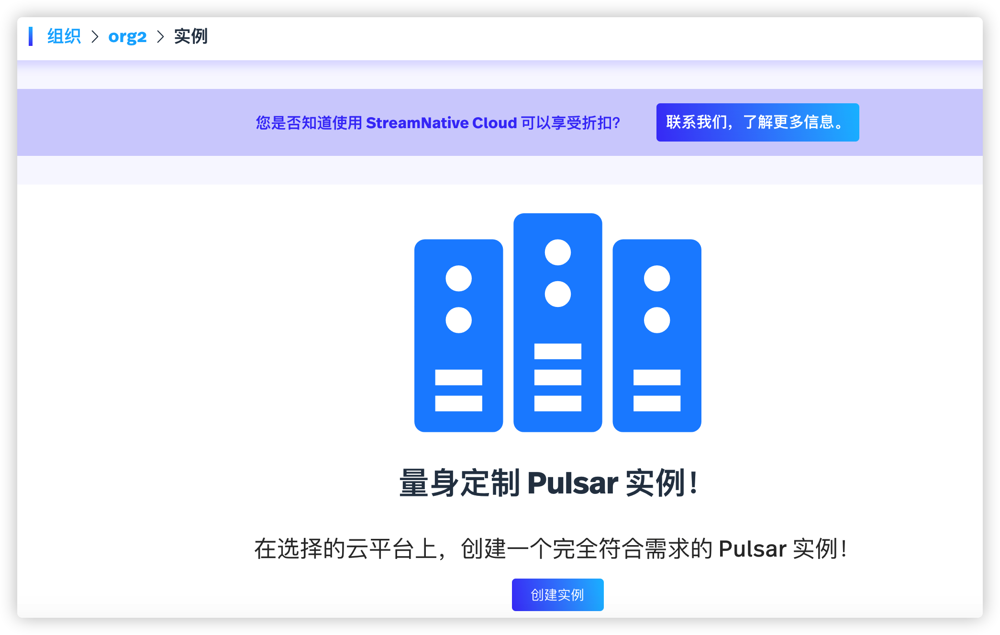
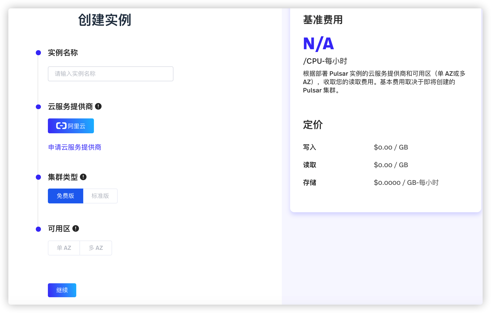
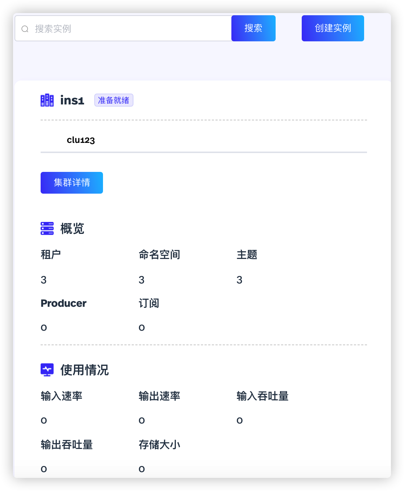
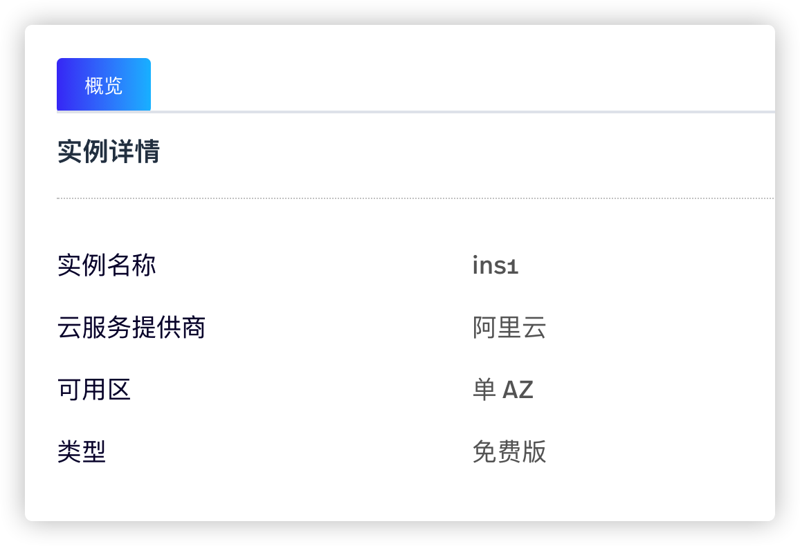

Pulsar 实例由一个或多个 Pulsar 集群组成。

# 配置实例（snctl）

本节介绍如何通过 snctl 创建、管理实例。

## 前提条件

创建组织。有关创建组织的详细信息，参见[创建组织](/use/organization.md#创建组织)。本节使用 `matrix` 作为组织的名称。

## 创建实例（snctl）

如需创建实例，遵循以下步骤。

1. 创建 `instance-neo.yaml` 文件，并在 `.yaml` 文件中定义实例 `neo` 的配置，如下所示。

    ```yaml
    apiVersion: cloud.streamnative.io/v1alpha1
    kind: PulsarInstance
    metadata:
      namespace: matrix
      name: neo
    spec:
      availabilityMode: zonal
    ```

    下表列出 `.yaml` 文件中的各项参数。

    | 参数 | 描述 |
    | --- | --- |
    | apiVersion| 指定 Pulsar API 服务器的版本。|
    | kind | 指定要创建的 StreamNative Cloud 组件。|
    | metadata | 配置实例的元数据信息。 <br>-namespace：指定实例所在的组织。<br>-name：指定实例名称。|
    | spec | 配置实例的参数。支持 `zonal` 或 `regional`。缺省情况下，配置为 `zonal`。 <br>-availabilityMode：配置实例的可用区参数，支持 `zonal` 或 `regional`。缺省情况下，配置为 `zonal`。免费集群只支持 `zonal` 取值。 <br>-type：配置实例支持的集群类型。如果不指定该参数，则默认创建标准集群的实例。如需创建免费集群的实例，该选项只能配置为 `free`。|

2. 下发 `.yaml` 文件，创建实例 `neo`。

    ```bash
    snctl apply -f /path/to/instance-neo.yaml
    ```

3. 查看是否成功创建实例。

    ```
    snctl describe pulsarinstance neo
    ```

    **命令回显**
    ```
    Name:         neo
    Namespace:    matrix
    Labels:       <none>
    Annotations:  <none>
    API Version:  cloud.streamnative.io/v1alpha1
    Kind:         PulsarInstance
    Metadata:
      Creation Timestamp:  2020-08-11T07:37:49Z
      Finalizers:
        pulsarinstance.finalizers.cloud.streamnative.io
      Generation:        1
      Resource Version:  367947
      Self Link:         /apis/cloud.streamnative.io/v1alpha1/namespaces/matrix/pulsarinstances/neo
      UID:               53f2958d-c7c9-4628-9290-a34e36cdca3b
    Spec:
      Availability Mode:  zonal
    Status:
      Auth:
        oauth2:
          Audience:    urn:sn:pulsar:test:test
          Issuer URL:  https://auth.streamnative.cloud.cn
        Type:          oauth2
      Conditions:
        Last Transition Time:  2020-08-11T07:38:00Z
        Status:                True
        Type:                  SubscriptionReady
        Last Transition Time:  2020-08-11T07:37:51Z
        Reason:                Created
        Status:                True
        Type:                  ResourceServerReady
        Last Transition Time:  2020-08-11T07:37:51Z
        Reason:                Created
        Status:                True
        Type:                  ServiceAccountReady
        Last Transition Time:  2020-08-11T07:38:01Z
        Reason:                AllConditionStatusTrue
        Status:                True
        Type:                  Ready
    Events:                    <none>
    ```

    当 `status` 和 `type` 参数的取值为 `true` 和 `ready` 时，则表示已成功创建实例。

用户也可以使用 `snctl create pulsarinstance PULSAR_INSTANCE_NAME` 命令创建实例。有关详细信息，参见 [snctl CLI 参考](https://docs.streamnative.io/snctl/v0.7.0/)。

## 查看实例（snctl）

运行以下命令，查看所有已创建的实例。

```bash
snctl get pulsarinstance
```

**命令回显**

```shell
NAME            CREATED AT
instance-test   2020-08-13T14:14:43Z
neo            2020-08-11T07:37:49Z
test-orga-a     2020-08-12T05:32:33Z
```

## 查看实例详情（snctl）

如需查看指定实例的详细信息，遵循以下步骤。

1. 确认目标实例是否存在。

    ```bash
    snctl get pulsarinstance
    ```

2. 运行以下命令，查看指定实例的详细信息。

    ```bash
    snctl describe pulsarinstance PULSAR_INSTANCE_NAME
    ```

以下示例说明如何查看 `neo` 实例的详细信息。

```bash
snctl describe pulsarinstance neo
```

**命令回显**

```
Name:         neo
Namespace:    matrix
Labels:       <none>
Annotations:  <none>
API Version:  cloud.streamnative.io/v1alpha1
Kind:         PulsarInstance
Metadata:
  Creation Timestamp:  2020-08-11T07:37:49Z
  Finalizers:
    pulsarinstance.finalizers.cloud.streamnative.io
  Generation:        1
  Resource Version:  367947
  Self Link:         /apis/cloud.streamnative.io/v1alpha1/namespaces/matrix/pulsarinstances/neo
  UID:               53f2958d-c7c9-4628-9290-a34e36cdca3b
Spec:
  Availability Mode:  zonal
Status:
  Auth:
    oauth2:
      Audience:    urn:sn:pulsar:test:test
      Issuer URL:  https://auth.streamnative.cloud.cn
    Type:          oauth2
  Conditions:
    Last Transition Time:  2020-08-11T07:38:00Z
    Status:                True
    Type:                  SubscriptionReady
    Last Transition Time:  2020-08-11T07:37:51Z
    Reason:                Created
    Status:                True
    Type:                  ResourceServerReady
    Last Transition Time:  2020-08-11T07:37:51Z
    Reason:                Created
    Status:                True
    Type:                  ServiceAccountReady
    Last Transition Time:  2020-08-11T07:38:01Z
    Reason:                AllConditionStatusTrue
    Status:                True
    Type:                  Ready
Events:                    <none>
```

## 删除实例（snctl）

运行以下命令，根据实例名称，删除指定实例。

```bash
snctl delete pulsarinstance PULSAR_INSTANCE_NAME
```

StreamNative Cloud 也支持在 `.yaml` 文件中定义实例类型和实例名称，然后下发该 `.yaml` 文件，删除指定实例。

```
snctl delete -f ./instance-neo.yaml
```

# 配置实例（StreamNative Cloud Manager）

本节介绍如何通过 StreamNative Cloud Manager 创建、管理实例。

## 前提条件

创建组织。有关创建组织的详细信息，参见[创建组织](/use/organization.md#创建组织)。

## 创建实例（StreamNative Cloud Manager）

如需创建实例，遵循以下步骤。

1. 单击新创建的组织，进入**创建 Pulsar 实例**页面。

   

2. 单击**创建实例**按钮。

   

3. 在弹出的页面上，配置实例参数，如下所示。然后单击**继续**按钮。

    | 参数 | 描述 |
    | --- | --- |
    | 实例名称 | 输入实例名称，字符串形式，支持小写字母（a～z）、数字（0～9）、特殊字符（“-”）。 |
    | 云服务提供商 | 选择云服务提供商。云服务提供商影响集群的配置选项、客户端访问集群的网络延迟、集群中节点的地理位置、以及运行集群的成本。目前，只支持阿里云。|
    | 集群类型 | 选择集群类型。目前，仅支持**免费版**集群。|
    | 可用区 | 选择实例部署方式。 <br>- 单 AZ：在单 AZ 上部署实例。 <br>- 多 AZ：在多 AZ 上部署实例。如果**集群类型**配置为**免费版**，则该选项不可用。|

4. 单击**继续**按钮。在弹出的页面，查看实例的创建进度。

## 查看实例（StreamNative Cloud Manager）

如需查看已创建的实例，遵循以下步骤。

1. 在 StreamNative Cloud Manager 主界面，单击右上角用户账户右侧的下拉菜单，然后选择**切换组织**。

2. 单击目标组织，查看组织中的实例。用户还可以查看实例的状态、整体信息、使用情况等信息，如下所示。

    

用户还可以执行以下操作：

- 创建实例：单击**创建实例**按钮，然后按照创建实例的步骤，创建更多实例。有关如何创建实例的详细信息，参见[创建实例](#创建实例streamnative-cloud-manager)。
- 查询实例：输入实例命名，单击**搜索**按钮，查询特定实例。

## 查看实例详情（StreamNative Cloud Manager）

在左侧导航栏，单击**管理 > 实例配置**，查看实例的详细信息，包括实例名称、云服务提供商、集群部署方式、集群类型。



## 删除实例（StreamNative Cloud Manager）

如需删除实例，遵循以下步骤。

1. 在**组织**页面，单击目标实例。

2. 在弹出的页面，单击**删除实例**按钮，弹出提示框。

3. 在**删除**对话框，单击**确定**按钮，删除实例。

# 下一步

- [配置集群](/use/cluster.md)
