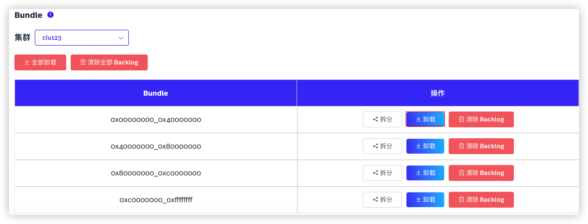
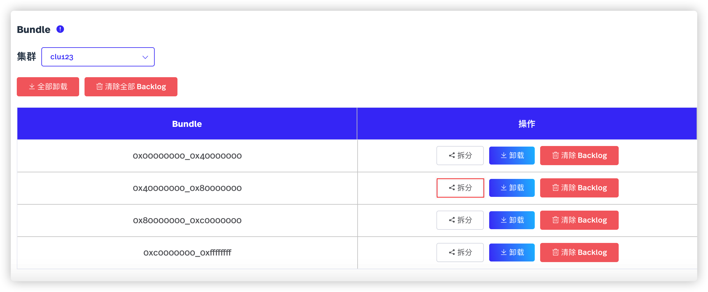
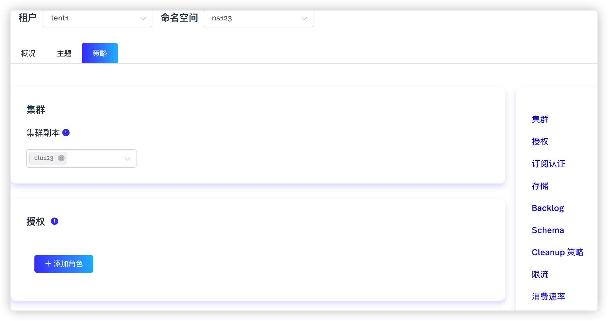

命名空间是主题的逻辑分组。创建租户后，用户可以为该租户创建一个或多个命名空间。

# 配置命名空间（snctl）

目前，snctl 不支持创建或管理命名空间。用户可以通过 [StreamNative Cloud Manager](https://console.streamnative.cloud/?defaultMethod=login) 创建、管理命名空间。有关如何创建命名空间的详细信息，参见[创建命名空间](#创建命名空间)。用户也可以使用 [pulsarctl](/platform/latest/manage-and-monitor/pulsarctl/overview) CLI 工具管理命名空间。有关如何通过 pulsarctl CLI 工具管理命名空间的详细信息，参见[使用 pulsarctl](/platform/latest/manage-and-monitor/pulsarctl/use)。

# 配置命名空间（StreamNative Cloud Manager）

本节介绍如何通过 StreamNative Cloud Manager 创建、管理命名空间。

## 创建命名空间

如需创建命名空间，遵循以下步骤。

1. 在左侧导航栏，单击**命名空间**。

2. 单击**创建命名空间**按钮，进入**创建命名空间**页面，如下所示。

    

3. 输入命名空间名称，然后单击**确定**按钮。命名空间名称，字符串形式，支持小写字母（a～z）、数字（0～9）、特殊字符（“-”）。

## 管理命名空间

本节介绍如何通过 StreamNative Cloud Manager 管理命名空间。

1. 在左侧导航栏，单击**命名空间**。

2. 在**操作**列，单击**编辑**按钮（铅笔图标）或者单击命名空间名称，进入编辑命名空间的页面。

3. 选择**概况**页签，查看命名空间的统计信息。在本页面，用户还可以卸载、拆分 bundle。下表列出命名空间的统计信息。

    | 参数 | 描述 |
    | --- | --- |
    | 输入速率 | 命名空间的输入速率。 |
    | 输出速率 | 命名空间的输出速率。 |
    | 输入吞吐量| 命名空间的输入吞吐量。 |
    | 输出吞吐量 | 命名空间的输出吞吐量。 |

4. 选择**主题**页签，查看命名空间的主题以及主题的统计信息。在本页面，用户还可以更新主题。有关如何更新主题的详细信息，参见[编辑主题](/use/topic.md#编辑主题)。

5. 选择**策略**页签，配置命名空间的相关策略。有关配置命名空间策略的详细信息，参见[配置命名空间的策略](#配置命名空间的策略)。

### 卸载 bundle

命名空间由一定数量的 bundle 组成。命名空间的所有主题均通过 Hash 方式映射到唯一 bundle 上。然后通过加载、卸载 bundle，将主题加载或卸载到提供服务的 broker 上。如果某个 broker 没有 bundle 或者 bundle 的数量教少，那么这个 broker 的流量就会低于其他 broker 的流量。缺省情况下，每个命名空间由 4 个 bundle 组成。

如需卸载 bundle，遵循以下步骤。

1. 在左侧导航栏，单击**命名空间**。

2. 在**操作**列，单击**编辑**按钮（铅笔图标）或者单击命名空间名称，进入编辑命名空间的页面。

3. 选择**概况**页签。

   

4. 在 **Bundle** 区域，从**集群**下拉菜单中选择目标集群，然后单击**全部卸载**按钮，卸载集群中所有命名空间的 bundle。

5. 单击目标 bundle 左侧的**卸载**按钮，卸载指定 bundle。

### 拆分 bundle

由于 bundle 中主题的负载可能会随时间变化，因此 broker 可以将一个 bundle 拆分成两个较小的 bundle。然后，broker 将较小的 bundle 重新分配给其他 broker。缺省情况下，新拆分的 bundle 会立即卸载流量到其他 broker，以实现负载均衡。

如需拆分 bundle，遵循以下步骤。

1. 在左侧导航栏，单击**命名空间**。

2. 在**操作**列，单击**编辑**按钮（铅笔图标）或者单击命名空间名称，进入编辑命名空间的页面。

3. 选择**概况**页签。

   

4. 单击目标 bundle 左侧的**拆分**按钮，拆分指定 bundle。

### 配置命名空间的策略

如需配置命名空间的策略，遵循以下步骤。

1. 在左侧导航栏，单击**命名空间**。

2. 在**操作**列，单击**编辑**按钮（铅笔图标）或者单击命名空间名称，进入编辑命名空间的页面。

3. 选择**策略**页签。

   

4. 在编辑命名空间页面，配置命名空间的策略，如下所示。

    | 参数 | 描述 |
    | --- | --- |
    | 集群 | 选择集群副本。在该命名空间，主题中的数据将被异步复制到配置的集群副本中。目前，由于一个实例只能配置一个集群，所以用户只能选择目标实例的集群。 |
    | 授权 | 授予或撤销其他客户端对该命名空间的权限。  - consume：授予或撤销其他客户端的消费权限。 - produce：授予或撤销其他客户端的生产权限。 - functions：授予或撤销其他客户端的 Pulsar functions 权限。 |
    | 订阅认证 | 配置订阅认证模式，以便在使能认证时限制订阅的命名规则。 - None：所有客户端均可以使用允许的订阅名称订阅消息。 - Prefix：客户端只能使用带有前缀的订阅名称订阅消息。   缺省情况下，取值为 `None`。 |
    | 存储 | 配置命名空间的存储策略。   **副本因子**：配置存储副本设置。 - Ensemble size：配置创建 ledger 所需的 bookie 的数量。  - Write Quorum Size：配置每条消息要存储的副本的数量。  - Ack Quorum Size：配置确定存储消息前需要等待的响应的次数。    **Mark-Delete 速率**：配置每秒执行 mark-deletion 回调的次数。如果取值为零，则表示禁用流量限速。缺省情况下，取值为零。   **消息加密**: 使能/禁用信息加密功能。  - 使能：使能信息加密功能。  - 禁用：禁用信息加密功能。   **消息去重**：使能/禁用消息去重功能。 - 使能：使能消息去重功能。 - 禁用：禁用消息去重功能。 |
    | Backlog | 配置命名空间的 backlog 策略。   **堆积量**：配置命名空间的最大堆积量（字节数）。堆积量必须小于 1000000000 字节。缺省情况下，取值为 -1073741824 字节。   **Backlog 保留策略**：配置 backlog 保留策略。  - consumer_backlog_eviction：Broker 开始丢弃堆积的消息。  - producer_exception：Broker 断开与客户端的连接，并抛出异常。 - producer_request_hold：在有可用资源之前（或在保持时间内），保留 Producer 发送的请求。|
    | Schema | 配置命名空间的 schema 策略。 - AutoUpdate 策略：配置命名空间的自动更新策略。 - Schema 有效性：使能 Schema 有效性，验证 Producer 携带的 Schema。如果禁用该功能，未携带 Schema 的 Producer 不允许向支持 Schema 的 Topic 发送消息。|
    | Cleanup 策略 | 配置命名空间的清除策略。 - 消息 TTL（秒）：配置消息 TTL（秒）。在 TTL 周期内，如果没有任何 Consumer 消费该消息，当 TTL 周期结束后，该消息被标记为`已消费`。 - 保留大小（字节）：配置要保留的消息大小。该配置只适用于被所有订阅签收的消息。取值必须小于 1000 MB。缺省情况下，取值为零。 - 保留周期（分钟）：配置消息的保留周期。该配置只适用于被所有订阅签收的消息。缺省情况下，取值为零。 - 压缩阈值（字节）：配置压缩阈值。当达到阈值后，自动触发 Topic 压缩。缺省情况下，取值为零。 - 卸载阈值（字节）：配置卸载阈值。当达到阈值后，自动将消息卸载到分层存储中。缺省情况下，取值为 -1。  - Offload Deletion Lag（毫秒）：配置删除从 BookKeeper 中卸载的 Ledger 之前，需要等待的时间（毫秒）。如果取值为负数，则表示禁止删除从 BookKeeper 中卸载的 Ledger。|
    | 限流 | 配置命名空间的限流策略。 - 最大 Producer 数量（基于主题）：配置每个主题支持的 Producer 的最大数量。 - 最大 Consumer 数量（基于主题）：配置每个主题支持的 Consumer 的最大数量。  - 最大 Consumer 数量（基于订阅）：配置每个订阅支持的 Consumer 的最大数量。|
    | 消费速率| 配置命名空间的消费速率策略。|   **消费速率（基于主题）**：配置基于主题的消费速率。 - 吞吐量（字节/秒）：配置基于主题的吞吐量，单位为字节/秒。 - 速率（消息/秒）：配置基于主题的速率，单位为消息/秒。 - 周期（秒）：配置基于主题的消费周期。  **消费速率（基于订阅）**：配置基于订阅的消费速率。 - 吞吐量（字节/秒）：配置基于订阅的吞吐量，单位为字节/秒。 - 速率（消息/秒）：配置基于订阅的速率，单位为消息/秒。 - 周期（秒）：配置基于订阅的消费周期。   **订阅速率（基于 Consumer）**：配置 Consumer 的订阅速率。 - 订阅速率（字节/秒）：配置 Consumer 的订阅速率。 - 订阅周期（秒）：配置 Consumer 的订阅周期。|

### 删除命名空间

如需删除命名空间，遵循以下步骤。

1. 在左侧导航栏，单击**命名空间**。

2. 在**操作**列，单击**删除**按钮（垃圾桶图标）。

3. 在**删除**对话框，单击**确定**按钮，删除命名空间。

# 下一步

- [配置主题](/use/topic.md)