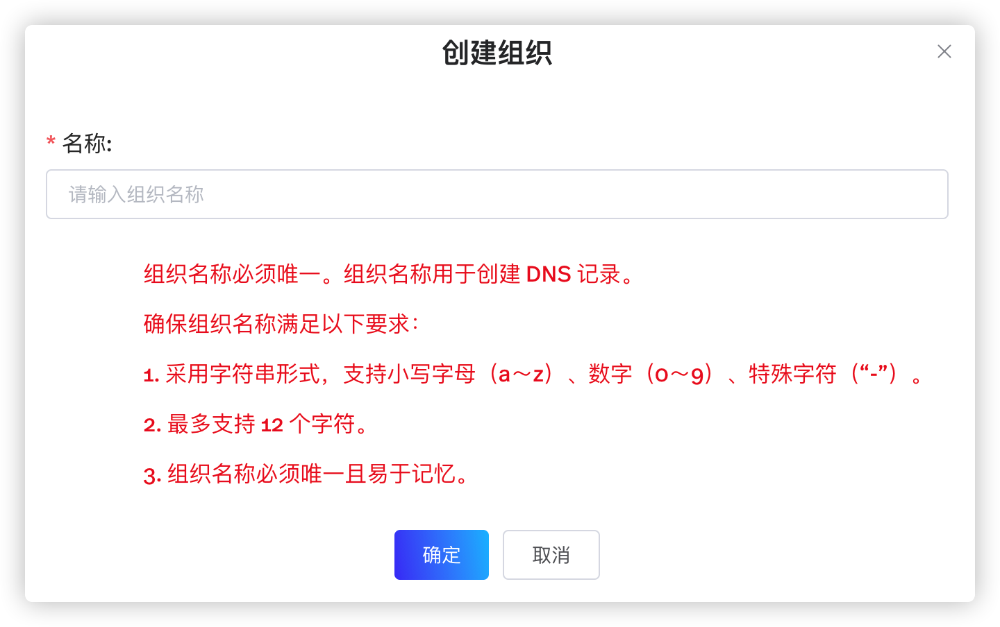

StreamNative Cloud 支持根据用户的实际应用在选定的云平台上配置管理组织。

# 配置管理组织（snctl）

目前，StreamNative Cloud 不支持使用 snctl 创建组织。用户可以使用 [StreamNative Cloud Manager](https://console.cloud.streamnative.cn) 创建组织。有关创建组织的详细信息，参见[创建组织](#创建组织)。

用户可以使用 `snctl config set --namespace` 指定缺省组织。配置完成后，当使用 `snctl` 命令配置管理其他 StreamNative Cloud 组件时，无需再指定组织名称。

# 配置管理组织（StreamNative Cloud Manager）

## 前提条件

登录 [StreamNative Cloud Manager](https://console.cloud.streamnative.cn/?defaultMethod=login)。

## 创建组织

如需创建组织，遵循以下步骤。

1. 单击**创建组织**按钮，进入创建组织页面，如下所示。

    

2. 在弹出的页面，输入组织名称，然后单击**确定**按钮。组织名称必须唯一且易于记忆。采用字符串形式，最多支持 12 个字符。支持小写字母（a～z）、数字（0～9）、特殊字符（“-”）。

    

## 查看组织

在 StreamNative Cloud Manager 主界面，查看已创建的组织。用户还可以执行以下操作：

- 创建组织。单击**创建组织**按钮，创建组织。
- 查询组织：输入组织名称，然后单击**搜索**按钮，查询特定组织。

# 下一步

- [配置实例](/use/instance.md)
