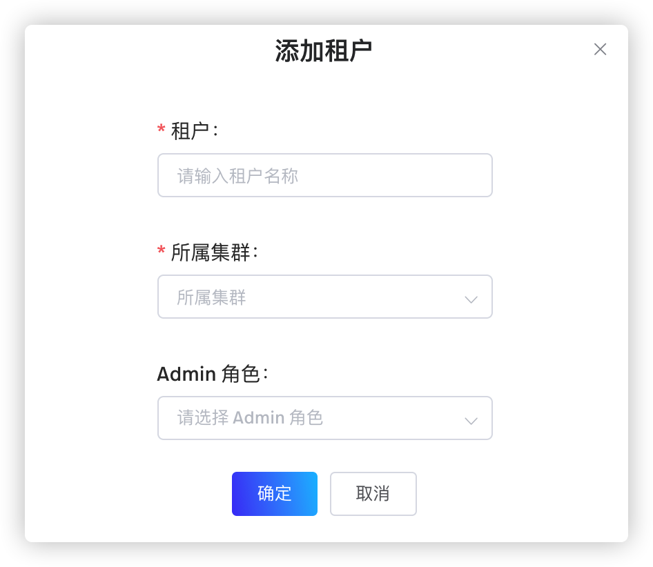
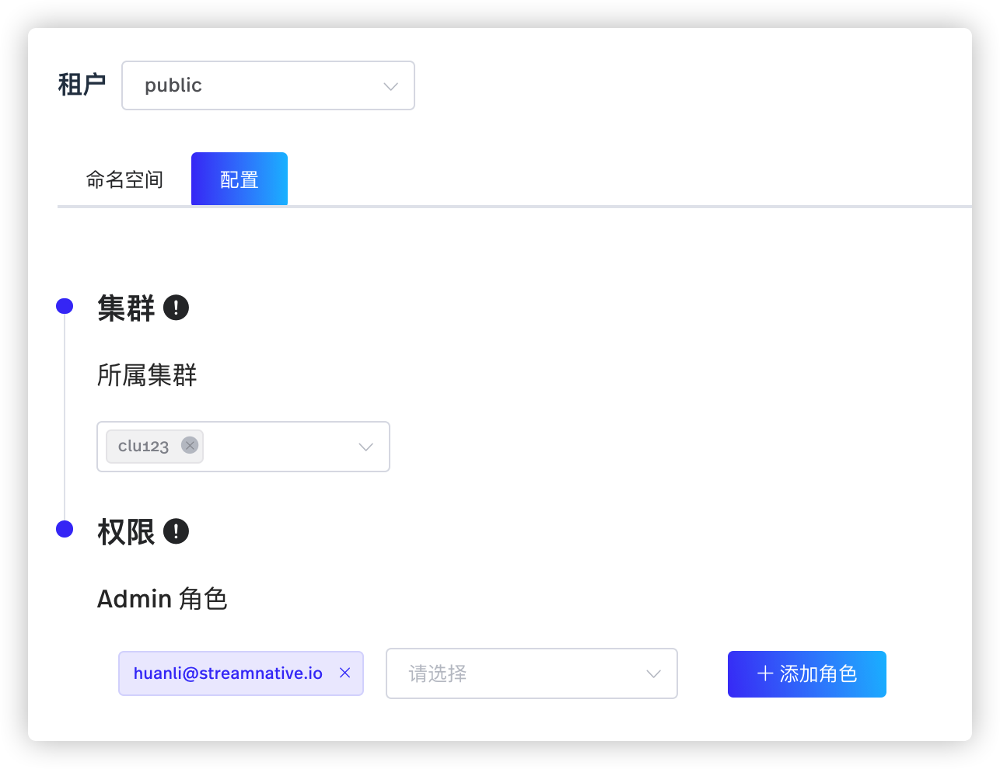

租户是一个管理堆积量、进行身份验证或授权的管理单元。创建集群后，用户可以为组织创建一个或多个租户。

# 配置租户（snctl）

目前，snctl 不支持创建或管理租户。用户可以通过 [StreamNative Cloud Manager](https://console.streamnative.cloud/?defaultMethod=login) 创建、管理租户。有关如何创建租户的详细信息，参见[创建租户](#创建租户)。用户还可以使用 [pulsarctl](/platform/latest/manage-and-monitor/pulsarctl/overview) CLI 工具管理租户。有关如何通过 pulsarctl CLI 工具管理租户的详细信息，参见[使用 pulsarctl](/platform/latest/manage-and-monitor/pulsarctl/use)。

# 配置租户（StreamNative Cloud Manager）

本节介绍如何通过 StreamNative Cloud Manager 创建、管理租户。

## 创建租户

如需创建租户，遵循以下步骤。

1. 在左侧导航栏，单击**租户**。
   
2. 单击**添加租户**按钮，进入**添加租户**页面，如下所示。
   
   

3. 在弹出的页面，配置租户参数，如下所示。

    | 参数 | 描述 |
    | --- | --- |
    | 租户名称 | 输入租户名称，字符串形式，支持小写字母（a～z）、数字（0～9）、特殊字符（“-”）。 |
    | 所属集群 | 配置租户的所属集群。 |
    | Admin 角色 |（可选项）为租户配置一个或多个 Admin 角色。|

4. 单击**确定**按钮，创建租户。

## 管理租户

本节介绍如何通过 StreamNative Cloud Manager 管理租户。

### 编辑租户

如需编辑租户，遵循以下步骤。

1. 在左侧导航栏，单击**租户**。

2. 在**操作**列，单击**编辑**按钮（铅笔图标）或者单击租户名称，进入编辑租户的页面。

   

3. 在编辑租户页面，选择**命名空间**页签，然后单击**创建命名空间**按钮，添加更多命名空间。有关如何创建命名空间的详细信息，参见[创建命名空间](/use/namespace.md#创建命名空间)。

4. 选择**配置**页签，更新租户参数，如下所示。

    | 参数 | 描述 |
    | --- | --- |
    | 所属集群 | 配置租户的所属集群。|
    | Admin 角色 |（可选项）为租户配置一个或多个 Admin 角色。或者，单击**添加角色**，为租户添加更多 Admin 角色。|

### 删除租户

如需删除租户，遵循以下步骤。

1. 在左侧导航栏，单击**租户**。

2. 在**操作**列，单击**删除**按钮（垃圾桶图标），弹出提示框。

3. 在**删除**对话框，单击**确定**按钮，删除租户。

> **说明**  
> 如果租户有关联的资源，则无法删除租户。

# 下一步

- [配置命名空间](/use/namespace.md)
