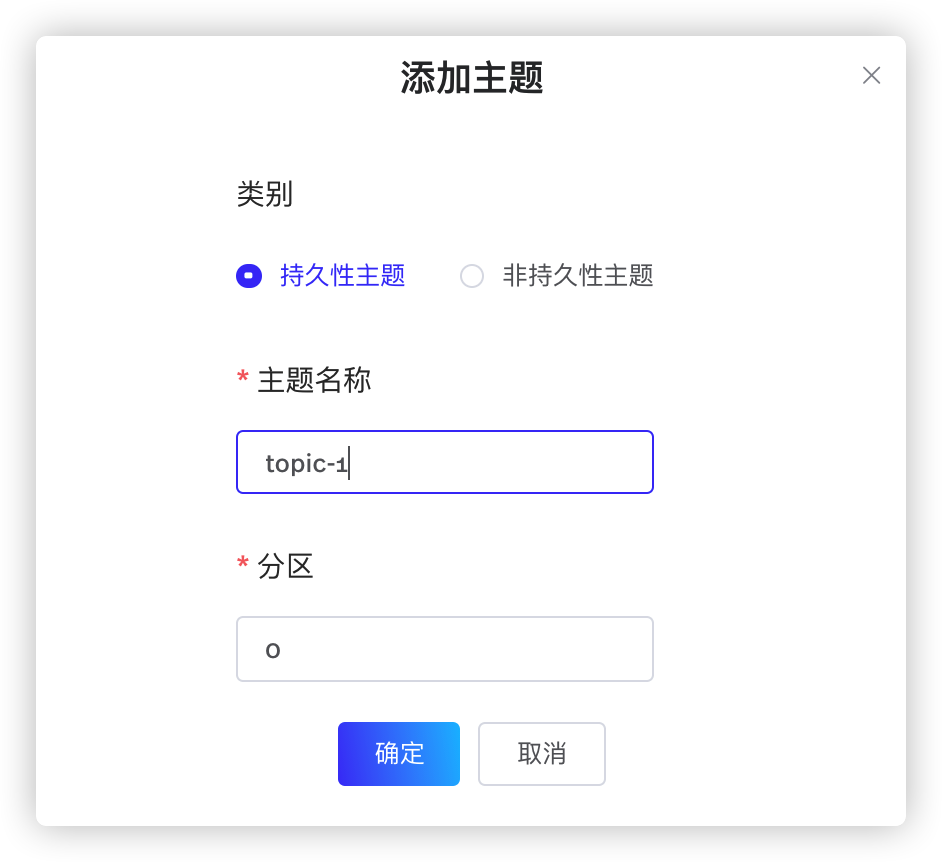
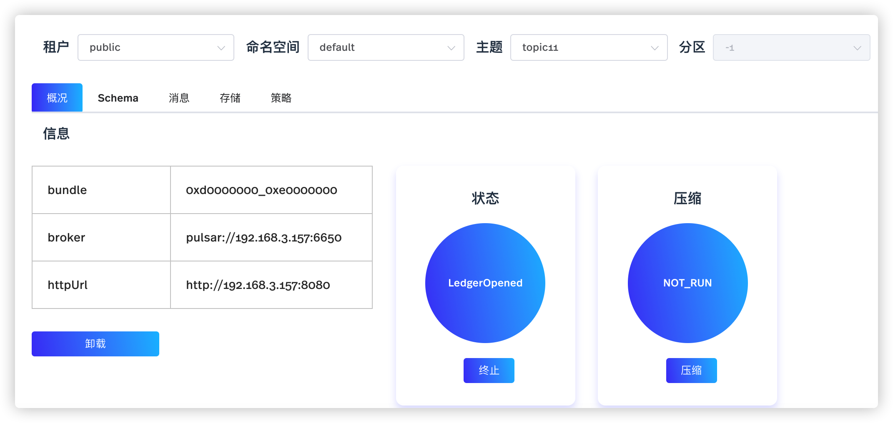
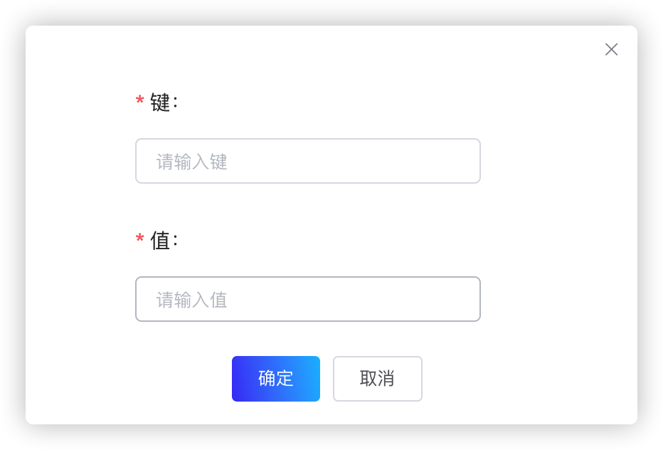
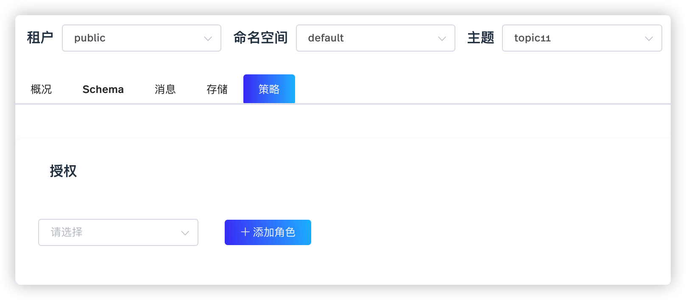

主题是用于将 Producer 发布的消息传递给 Consumer 的命名通道。创建命名空间后，用户可以为命名空间创建一个或多个主题。

# 配置主题（snctl）

目前，snctl 不支持创建或管理主题。用户可以通过 [StreamNative Cloud Manager](https://console.streamnative.cloud/?defaultMethod=login) 创建、管理主题。有关如何创建主题的详细信息，参见[创建主题](#创建主题)。用户也可以使用 [pulsarctl](/platform/latest/manage-and-monitor/pulsarctl/overview) CLI 工具管理主题。有关如何通过 pulsarctl CLI 工具管理主题的详细信息，参见[使用 pulsarctl](/platform/latest/manage-and-monitor/pulsarctl/use)。

# 配置主题（StreamNative Cloud Manager）

本节介绍如何通过 StreamNative Cloud Manager 创建、管理主题。

## 创建主题

如需创建主题，遵循以下步骤。

1. 在左侧导航栏，单击**主题**。
   
2. 单击**添加主题**按钮，进入**添加主题**页面，如下所示。
   
   

3. 在弹出的页面，配置主题参数，如下所示。

    | 参数 | 描述 |
    |---|---|
    | 主题类型 | 配置主题类型。  - 持久性主题：持久性主题中的消息，永久地保存在存储磁盘上。  - 非持久性主题：非持久性主题中的消息，不会永久地保存在存储磁盘上。   缺省情况下，系统创建持久性主题。 |
    | 主题名称 | 输入主题名称，字符串形式，支持小写字母（a～z）、数字（0～9）、特殊字符（“-”）。|
    | 分区 |（可选）配置分区主题的分区数量。如果取值为零，则表示该主题不是分区主题。缺省情况下，分区主题最多支持 16 个分区。|

4. 单击**确定**按钮，创建主题。

5. （可选）单击**添加主题**按钮，创建更多主题。

## 管理主题

本节介绍如何通过 StreamNative Cloud Manager 管理主题。

### 配置主题的基本操作

本节主要介绍如终止、压缩主题，配置主题的订阅名称，以及如何查看特定主题的详细信息。

1. 在左侧导航栏，单击**主题**。

2. 单击主题名称链接。或者单击分区主题的分区链接。

3. 选择**概况**页签。

   

    在**概况**页面，用户可以执行以下操作。

    - 卸载主题：单击**卸载**按钮，卸载主题。
    - 终止主题：单击**终止**按钮，终止主题。
    - 压缩主题：单击**压缩**按钮，压缩主题。
    - 配置主题的订阅名称：单击**添加订阅**按钮，在弹出的对话框中，输入主题的订阅名称，然后单击**确定**按钮。StreamNative Cloud Manager 支持根据订阅名称管理主题。
    - 查看主题：查看主题的详细信息。

    下表列出主题的详细信息。

    | 参数 | 描述 |
    | --- | --- |
    | **基本信息**|
    | 输入速率 | 查看主题的输入速率。 |
    | 输出速率 | 查看主题的输出速率。 |
    | 输入吞吐量| 查看主题的输入吞吐量。 |
    | 输出吞吐量 | 查看主题的输出吞吐量。 |
    | **Producer** |
    | Producer ID| 查看向主题发布消息的 Producer 的 ID。|
    | Producer 名称| 查看向主题发布消息的 Producer 的名称。|
    | 输入速率| 查看主题的输入速率。 |
    | 输入吞吐量| 查看主题的输入吞吐量。|
    | 平均消息大小 | 查看主题的平均消息大小。|
    | 地址 | 查看主题的地址。 |
    | 创建时间 | 查看创建 Producer 的时间。 |
    | **订阅**|
    | 订阅名称 | 查看主题的订阅名称。|
    | 订阅类型 | 查看主题的订阅类型。目前 StreamNative Cloud Manager 不支持配置主题的订阅类型。用户可以通过 Pulsar Manager 配置主题的订阅类型。|
    | 输出速率 | 查看主题的输出速率。 |
    | 输出吞吐量 | 查看主题的输出吞吐量。 |
    | 过期消息 | 查看主题中过期的消息。 |
    | 堆积量 | 配置消息堆积量。  - SKIP：跳过某些消息。  - EXPIRE：当在指定时间内未签收消息时，该消息过期。  - CLEAR：清除消息的堆积量。  - RESET BY ID：重置创建订阅的消息 ID。  - RESET BY TIME：重置创建订阅的时间。  - PEEK：查看消息。 - UNSUBSCRIBE：删除订阅。|

### 创建 Schema

> **说明**  
> 目前，只支持 Avro 和 JSON Schema。

如需配置主题的 Schema，遵循以下步骤。

1. 在左侧导航栏，单击**主题**。

2. 单击主题名称链接。或者单击分区主题的分区链接。

3. 选择 **Schema** 页签。

4. 单击**创建 Schema** 按钮，然后下拉页面。

5.  从 **Schema 类型**下拉菜单，选择 Schema 类型。

6.  单击 **+** 图标，弹出创建 Schema 类型的对话框，如下所示。

   

7.  在弹出的对话框，配置 Schema 的键值，然后单击**确定**按钮。

### 查看消息

如需查看发布到主题中的消息，遵循以下步骤。

1. 在左侧导航栏，单击**主题**。

2. 单击主题名称链接。或者单击分区主题的分区链接。

3. 选择**消息**页签，查看主题中消息的相关信息，如下所示。

    | 参数 | 描述 |
    | --- | --- |
    | 订阅名称 |查看主题的订阅名称。 |
    | 订阅类型 | 查看主题的订阅类型。目前 StreamNative Cloud Manager 不支持配置主题的订阅类型。用户可以通过 Pulsar Manager 配置主题的订阅类型。|
    | 输出速率 | 查看主题的输出速率。 |
    | 输出吞吐量 | 查看主题的输出吞吐量。 |
    | 过期消息 | 查看主题中过期的消息。 |
    | PEEK | 查看订阅的消息。  - 消息 ID：根据消息 ID 查看消息。  - Message：已查看的消息。 |

### 查看存储信息

1. 在左侧导航栏，单击**主题**。

2. 单击主题名称链接。或者单击分区主题的分区链接。

3. 选择**存储**页签，配置主题的存储信息。
   
    | 参数 | 描述 |
    | --- | --- |
    | 存储大小| 存储大小 |
    | Entry| Entry 数量|
    | Segment| 分片数量 |
    | **Ledger** |
    | Ledger ID | Ledger ID|
    | Entry | Ledger 中 Entry 的数量。 |
    | Ledger 大小 | Ledger 中所有消息的大小（以字节为单位）。|
    | 状态 | 写入消息的 Ledger 状态。如果 Ledger 的状态配置为 `Opening`，则表示该 Ledger 支持存储 Producer 发布的消息。|
    | 卸载 | 配置是否卸载 Ledger。 |
    | **游标（Cursor）**|
    | 游标 ID |游标 ID |
    | 标记删除位置 | 在 `markDeletePosition` 标记之前发布的的所有消息均被 Subscriber 签收。 |
    | 读取位置 | Subscriber 上次读取消息的位置。 |
    | 等待读取操作| 如果参数配置为 `True`，则表示 Consumer 已签收最新发布的消息，等待更多即将发布的消息。 |
    | 挂起读取操作| BookKeeper 尚未处理的读请求的数量。|
    | 未签收的 Entry | 未签收的 Entry 的数量。 |

### 配置主题策略

如需配置主题策略，遵循以下步骤。

1. 在左侧导航栏，单击**主题**。

2. 单击主题名称链接。或者单击分区主题的分区链接。

3. 选择**策略**页签，配置主题的授权策略。
   
   

    | 参数 | 主题 |
    | --- | --- |
    | 授权 | 授予或撤销其他客户端对主题的权限。  - consume：授予或撤销其他客户端的消费权限。 - produce：授予或撤销其他客户端的生产权限。 - functions：授予或撤销其他客户端的 Pulsar functions 权限。 |

4. （可选）单击**添加角色**按钮，为主题配置更多角色。

### 删除主题

如需删除主题，遵循以下步骤。

1. 在左侧导航栏，单击**主题**。

2. 单击主题名称链接。或者单击分区主题的分区链接。

3. 选择**策略**页签，然后单击**删除主题**按钮。

4. 在**删除**对话框，单击**确定**按钮，删除主题。
